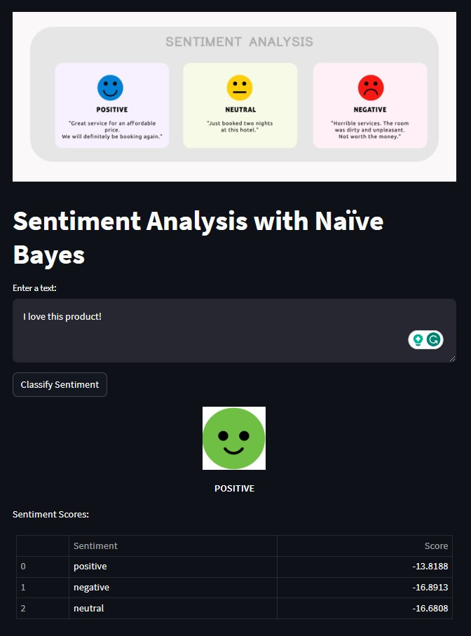
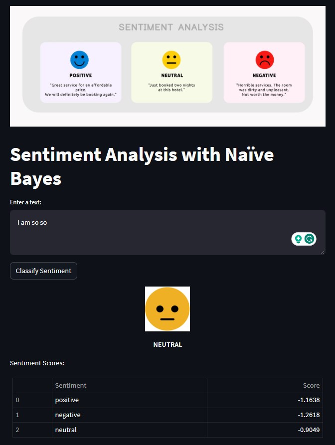
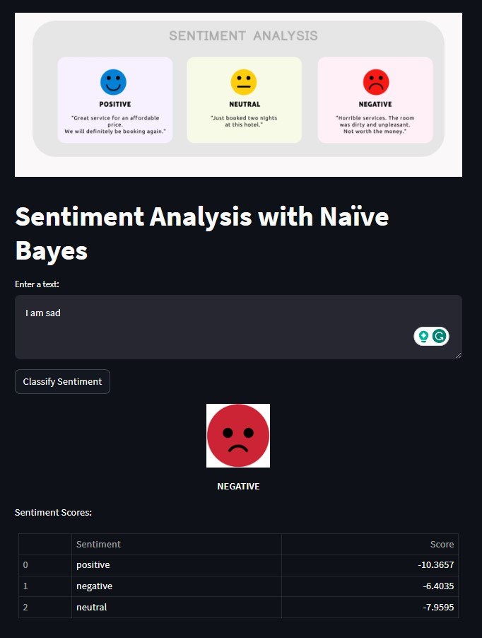

## Sentiment Analysis With Naive Bayes
   

<br>
<br>
<p align="center">
  
</p>
<br>


## Table of Contents
1. [Introduction](#introduction)
   
   1.1 [Project Description](#discription)

   1.2 [Project Motivation](#motivation)

2. [Project Overview](#project_overview)

   2.1 [Overview Dataset](#datasetoverview)

   2.2 [Dataset Problem statement](#problemstatement)

3. [Features](#Features)

4. [Project Directory Structure](#DirectoryStructure)

5. [Steps](#Steps)

   5.1 [Data Collection and Preprocessing](#exploratory-data-analysis)
   
   5.2 [Calculating Word Counts and Likelihoods](#data-preprocessing)

   5.3 [Train-Test Split and Model Training](#model-development)

   5.4 [Running the App](#evaluation-and-metrics)

   5.5 [Train-Test Split and Model Training](#model-development)

   5.6 [Interact with the App](#evaluation-and-metrics)

6. [Requirements](#Requirements)
7. [Usage](#usage)
8. [Screenshots](#Screenshots)
9. [EDA Notebook Structure](#EDA)
   
   9.1 [Running the Notebook](#exploratory-data-analysis1)

   9.2 [Results and Visualizations](#exploratory-data-analysis2)
10. [License](#License)
11. [Acknowledgements](#Acknowledgements)
12. [Contact Information](#Contact)

## Introduction <a name="introduction"></a>

### Project Description <a name="discription"></a>

Sentiment analysis is the process of determining the sentiment (positive, negative, neutral) expressed in a piece of text. This project uses the Naïve Bayes algorithm to classify the sentiment of input text and displays the results using a user-friendly Streamlit app.

### Project Motivation <a name="motivation"></a>
Sentiment analysis is a fundamental task in natural language processing that has various real-world applications. Understanding the sentiment expressed in text data can provide valuable insights into user opinions, emotions, and trends. This project was motivated by the desire to explore sentiment analysis techniques and showcase their implementation through an interactive web application.

The goals of this project include:

- Demonstrating how the Naïve Bayes algorithm can be used for sentiment classification.
- Creating an intuitive Streamlit app for users to easily interact with the sentiment analysis tool.
- Showcasing text preprocessing techniques to enhance the accuracy of sentiment predictions.
- Providing a practical example of using machine learning in real-world scenarios.

By sharing this project, we aim to contribute to the knowledge and understanding of sentiment analysis while providing a hands-on example for those interested in exploring natural language processing and interactive web application development.

## Project Overview <a name="project_overview"></a>
### Overview of the Dataset <a name="datasetoverview"></a>

The dataset used for this project is the "Tweet Sentiment Extraction" dataset from Kaggle. This dataset contains tweets along with their associated sentiment labels and selected text. The selected text provides a concise representation of the tweet's sentiment. The dataset is utilized to train sentiment analysis models for predicting the sentiment of tweets.

#### Columns

- `textID`: A unique ID for each piece of text.
- `text`: The text of the tweet.
- `sentiment`: The general sentiment label of the tweet (positive, negative, or neutral).
- `selected_text` (Training only): The text that supports the tweet's sentiment, serving as a sentiment indicator.

### Dataset Problem statement <a name="problemstatement"></a>

Given the text of a tweet, the task is to classify the sentiment as `positive`, `negative`, or `neutral`. This involves training a model to understand the emotional tone of the text.


# Project Directory Structure <a name="Structure"></a>
```bash
│                      
├── app.py                           # Streamlit application script
├── data                             # Directory for storing the dataset
│   └── train.csv                    # Sentiment dataset
├── images                           # Directory for sentiment image
│   ├── app_Sentiment_1.jpg          # web app screenshot 1
│   └── app_Sentiment_2.jpg          # web app screenshot 2
│   └── app_Sentiment_3.jpg          # web app screenshort 3
│   └── negative.jpg                 # Positive sentiment image
│   └── neutral.jpg                  # Positive sentiment image
│   └── positive.jpg                 # Positive sentiment image
│   └── sentimentanalysishotelgeneric-2048x803-1.jpg
├── docs                             # documentation for your project
├── .gitignore                       # ignore files that cannot commit to Git
├── notebooks                        # store notebooks
│   └── EDA_sentiment_analysis.ipynb # EDA Notebook
├── logs.txt                         # Streamlit log files 
├── requirements.txt                 # List of required packages
├── README.md                        # Project README file
├── LICENSE                          # Project license
```

## Description <a name="Description"></a>

Sentiment analysis is the process of determining the sentiment (positive, negative, neutral) expressed in a piece of text. This project uses the Naïve Bayes algorithm to classify the sentiment of input text and displays the results using a user-friendly Streamlit app.

## Features <a name="Features"></a>

- Preprocesses text data (lowercase, punctuation removal, etc.).
- Calculates word counts and likelihoods for sentiment classification.
- Displays sentiment classification results with sentiment scores.
- Displays resized sentiment-specific images based on the predicted sentiment.
- Provides a visually appealing layout for user interaction.

## Steps <a name="Steps"></a>

1. **Data Collection and Preprocessing:** 
   - Gather a dataset containing positive, negative, and neutral sentiment-labeled text.
   - Preprocess the text data by converting to lowercase, removing punctuation, and tokenizing sentences.

2. **Calculating Word Counts and Likelihoods:**
   - Create word count tables for each sentiment class.
   - Calculate the likelihood of each word appearing in a specific sentiment class using Laplace smoothing.

3. **Train-Test Split and Model Training:**
   - Shuffle the dataset and split it into training and testing subsets.
   - Train the Naïve Bayes model using the training data and calculated likelihoods.

4. **Creating the Streamlit App:**
   - Build a Streamlit web application for user interaction.
   - Incorporate text input, sentiment classification, and display of sentiment scores.
   - Display sentiment-specific images based on the predicted sentiment.

5. **Running the App:**
   - Install the required packages using `pip install streamlit pandas nltk`.
   - Run the Streamlit app using `streamlit run app.py`.

6. **Interact with the App:**
   - Enter text in the provided text area and click the "Classify Sentiment" button.
   - View the predicted sentiment label, sentiment scores, and corresponding image.

## Requirements <a name="Requirements"></a>

- Python 3.x
- Streamlit
- Pandas
- NLTK (Natural Language Toolkit)

## Usage <a name="Usage"></a>

1. Clone this repository:
```bash
git clone https://github.com/zubairashfaque/Sentiment-Analysis-with-Naive-Bayes-Streamlit.git
```
2. Run the following command to create a virtual environment named "Sentiment_NB" (you can replace "Sentiment_NB" with any name you prefer):
```bash
python -m venv Sentiment_NB
```
3. To activate the virtual environment, use the following command:
```bash
Sentiment_NB\Scripts\activate
```
4. Install the required packages from the `requirements.txt` file:
```bash
pip install -r requirements.txt
```
5. Run the Streamlit app:
```bash
streamlit run app.py
```

6. Enter text in the provided text area and click the "Classify Sentiment" button to see the sentiment prediction and scores.


## Screenshots <a name="Screenshots"></a>

<br>
<br>
<p align="center">
  
</p>
<br>

<br>
<br>
<p align="center">
  
</p>
<br>
<br>
<br>
<p align="center">
  
</p>
<br>


## Notebook Structure <a name="EDA"></a>
The Jupyter Notebook (`EDA_sentiment_analysis.ipynb`) is structured as follows:

1. **Introduction and Setup:** Importing libraries and loading the dataset.
2. **Data Exploration:** Displaying basic dataset information.
3. **Sentiment Distribution Visualization:** Visualizing the distribution of sentiment labels.
4. **Text Preprocessing:** Defining preprocessing functions for tokenization and stemming.
5. **Word Count Analysis:** Calculating word counts for different sentiment classes.
6. **Top Words Visualization:** Displaying top words for each sentiment class and creating treemap visualizations.

## Running the Notebook <a name="exploratory-data-analysis1"></a>
Follow these steps to run the `EDA_sentiment_analysis.ipynb` notebook:

1. Ensure you have Python and the required libraries installed.
2. Open the notebook using Jupyter Notebook or Jupyter Lab.
3. Execute each cell sequentially to see the analysis results.

## Results and Visualizations <a name="exploratory-data-analysis2"></a>
The notebook produces various insightful visualizations, including:
- Sentiment distribution using a Funnel-Chart.
- Top words and their counts for positive, negative, and neutral sentiments.
- Treemap visualizations of top words for each sentiment class.

Sample images of these visualizations are provided in the repository's `images` folder.

## License <a name="License"></a>

This project is licensed under the [MIT License](LICENSE).

## Acknowledgements <a name="Acknowledgements"></a>

- The sentiment analysis algorithm is based on the Naïve Bayes approach.
- Streamlit is used for creating the user interface.
- NLTK is used for text preprocessing.

## Contact Information <a name="Contact"></a>
For questions, feedback, or discussions related to this project, you can contact me at [mianashfaque@gmail.com](mailto:mianashfaque@gmail.com).
